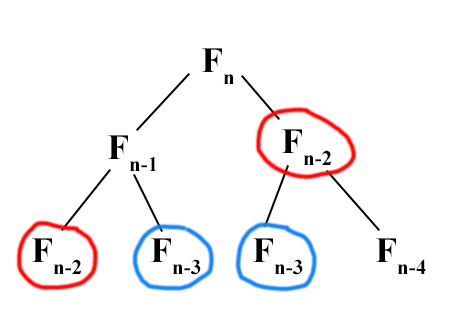

# Fibonacci Numbers

A mathematical series of numbers as Fibonacci numbers as to provide a foundation for building a [Golden ratio](https://en.wikipedia.org/wiki/Golden_ratio) number, could be computed in a recurrence relation:

Given function _Fn_ to denote the nth position of a Fibonacci sequence; And,

_F1_ = _F2_ = 1; _Fn_ = _Fn-1_ + _Fn-2_

## A Naive Algorithm

By adopting _top-down_ recursive approach,

<pre>
<code>
FIBONACCI(n)
  if n &les; 2 return 1
  else
    return FIBONACCI(n-1) + FIBONACCI(n-2)
</code>
</pre>

which comes down to a recurrence relation: &Tau;(n) = &Tau;(n-1) + &Tau;(n-2) + &Omicron;(1) &ges; &straightphi;n

&Tau;(n) &ges; 2 &sdot; &Tau;(n-2) + &Omicron;(1) &ges; 2n/2

Hence, it takes [exponential time](../asymptotic-analysis.md) to compute the nth fibonacci number, wherein lots of repetitive computations are being performed; Specifically in the following diagram,

<figure style="text-align:center">
  
  <figcaption>Figure 1. Fibonacci Numbers in Recursive Computations</figcaption>
</figure>

To improve upon that, a _memoized_ version of such algorithm is introduced:

<pre>
<code>
memo := {}
FIBONACCI(n)
  if n in memo
    return memo[n]
  else
    if n &les; 2 return 1
    else
      memo[n] := FIBONACCI(n-1) + FIBONACCI(n-2)
      return memo[n]
</code>
</pre>

Therefore, FIBONACCI(k) only takes **one** recursion, &forall; k &isin; n; and all memoized calls use &Theta;(1) time