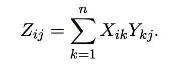
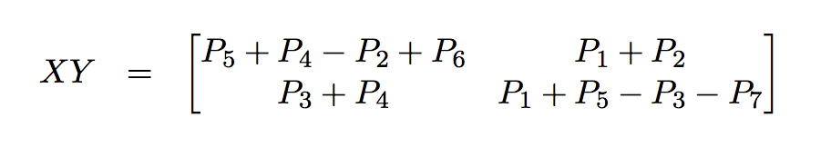

# Multiplication

This chapter concerns the naive multiplication algorithms and their non-trivial advanced counterparts which all take the form of DnC strategy.

---

## Integer Multiplication

Recall from what the teachers taught in grade-school a typical integer multiplication may take a form like below:

<figure style="text-align: center">
  
  <figcaption>Figure 1. The grade-school integer multiplication algorithm</figcaption>
</figure>

In this naive algorithm, the total number of operations is 3 (_3 operations per row for multiplication and addition_)· 3 (_3 rows in total_) = 9. Thus, roughly the running time estimation is &scy; &sdot; n2, bounded by &Omicron;(n2).

It is so widely adopted that less attention been paid to a more complex, yet efficient method.

### [Karatsuba Multiplication](https://en.wikipedia.org/wiki/Karatsuba_algorithm)

Assuming we are multiplying two n-digit numbers x and y; then dividing each of them:
x = 10n/2 &sdot; a + b, y = 10n/2 &sdot; c + d

And multiply them together as:
x &sdot; y =  10nac + 10n/2(bc + ad) + bd

Then, the algorithm in a [DnC][DnC] pattern has complexity: &Tau;(n) = 4&Tau;(n/2) + &Omicron;(n)

Applying the math trick discovered by [Carl Friedrich Gauss](https://en.wikipedia.org/wiki/Carl_Friedrich_Gauss), that (bc + ad) = (a + b)(c + d) - ac - bd, the complexity will be reduced to &Tau;(n) = 3&Tau;(n/2) + &Omicron;(n)

#### Pseudocode

<pre>
<code>
MULTIPLY(x, y)
  x, y are positive integers
  output: their product

  n = min(x, y)
  if n is 1, return xy

  xL, xR = leftmost [n/2], rightmost [n/2] of x
  yL, yR = leftmost [n/2], rightmost [n/2] of y

  P1 = MULTIPLY(xL, yL)
  P2 = MULTIPLY(xR, yR)
  P3 = MULTIPLY(xL + xR, yL + yR)

  return P1 * 10n + (P3 - P1 - P2) * 10n/2 + P2
</code>
</pre>

_**Note**: the x and y could be odd or even numbers and produce the correct result by padding bits before recursive calls and dropping bits before combination phase._

#### Algorithm Analysis

Upon analyzing the complexity of both the naive and Karatsuba multiplication, the [Master Method][master-method] comes into play.

In naive version of integer multiplication, &Tau;(n) = &Omicron;(n2); The DnC multiplication without optimization would be &Tau;(n) = 4 &Tau;(n / 2) + &Omicron;(n) = &Omicron;(nlog24) = &Omicron;(n2);

Obviously, the DnC multiplication without optimization equates the efficiency of the naive algorithm. After applying [Karatsuba multiplication](#karatsuba-multiplication) the overall complexity would be &Tau;(n) = 3 &Tau;(n / 2) + &Omicron;(n) = &Omicron;(nlog23) &ap; &Omicron;(n1.59).

Hence, the Karatsuba multiplication beats the naive integer multiplication algorithm in their running time efficiency.

---

## Matrix Multiplication

Matrix Multiplication, termed as Matrix dot Product as well, is a form of multiplication involving two matrices &Chi; (n &cross; n), &Upsilon; (n &cross; n)like below:

<figure style="text-align:center">
  
  <figcaption>Figure 2. Matrix Dot Product Mathematical Notation</figcaption>
</figure>

The preceeding formula indicates a &Omicron;(n3) running time given for each entry in the resulting array requires &Omicron;(n) operations and there are &Omicron;(n2) in total.

### Naive Matrix Split

It is intuitive to devise a [DnC][DnC] pattern like below:

<figure style="text-align:center">
  
  <figcaption>Figure 3. Matrix Divided into Blocks</figcaption>
</figure>

The resulting matrix dot product has 8 sub matrix products, 4 more additions and we could formulate a recurrence relation:

&Tau;(n) = 8 &Tau;(n / 2) + &Omicron;(n2)

According to [Master Method][master-method], the recurrence relation above boils down to: &Omicron;(nlog28) = &Omicron;(n3). Same as it is with the default matrix multiplication method though, there is a way to more efficiently compute the result.

### Strassen Matrix Multiplication

Developed by [V. Strassen](https://en.wikipedia.org/wiki/Volker_Strassen), an intricate matrix decomposition magically reduces the complexity;

<figure style="text-align:center">
  
  <figcaption>Figure 4. Strassen Multiplication Matrix Decomposition</figcaption>
</figure>

where

  &Rcy;1 = A (F - H), &Rcy;2 = (A + B) H, &Rcy;3 = (C + D) E, &Rcy;4 = D (G - E), &Rcy;5 = (A + D)(E + H), &Rcy;6 = (B - D)(G + H), &Rcy;7 = (A - C)(E + F)

Thus, new recurrence relation: &Tau;(n) = 7&Tau;(n / 2) + &Omicron;(n2)

By the [Master Method][master-method], the running time is &Omicron;(nlog27) &ap; &Omicron;(n2.81); it beats the [naive-matrix-split](#naive-matrix-split) method of [polynomial time](../asymptotic-analysis.md) &Omicron;(n3).

[DnC]: overview.md
[master-method]: master-method.md