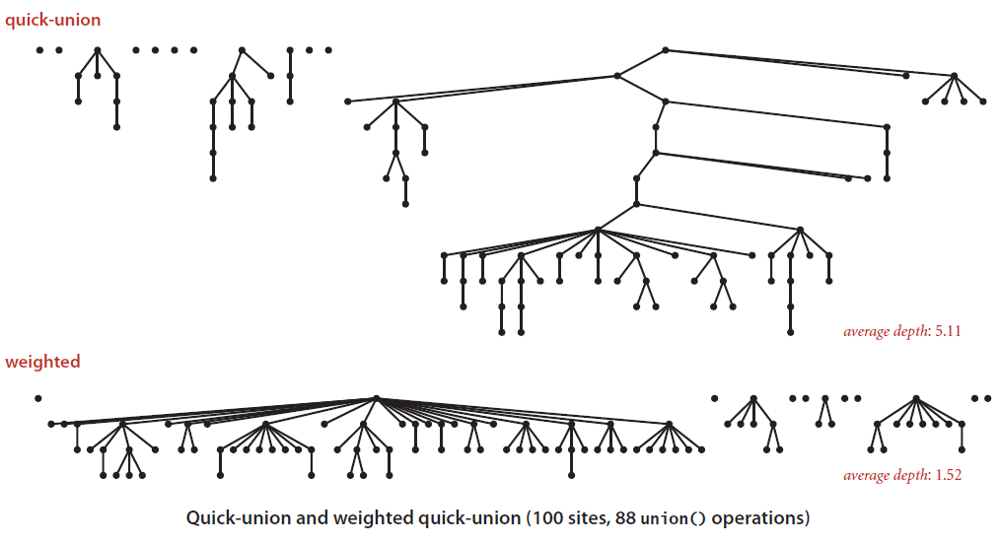

# Disjoint Set

There are applications that requires manipulations on elements distributed on disjoint sets, e.g. [Kruskal's Algorithm](../graph-algorithms/minimum-spanning-tree.md) of generating a minimum spanning tree needs to manage disjoint forests during the construction of a tree.

## Operations

A disjoint set data structure maintains a group of disjoint sets &Sscr; = {_S1_, _S2_, ..., _Sk_}; there is a **leader** element in each of the set to represent the set itself such that if no modifications made to a set between two set queries, the **leader**(s) for set representation remain the same.

Specifically, three operations are supported in disjoint set data structures:

1. **MAKE-SET(x)**: build a set with an only member x, which can not be contained in other sets.
2. **UNION(x, y)**: union the set &Sscr;x (contains x) with the set &Sscr;y (contains y) to form a new set; Since all the sets should be disjoint between any two of them, building a new set means eliminating the original sets &Sscr;x and &Sscr;y; Accordingly, the operation of **DELETE-FROM-SET(x)** is replaced by union an element of the original set with the new set.
3. **FIND-SET(x)**: return a pointer to a **leader** of a specific set.

## Dynamic Connectivity

In a [graph](../graph-algorithms/overview.md) structure with myriad connected information in consistent alterations, computing the connectivity among the vertices play an important role in relevant studies. Such term provides a basis for the [union-find](#union-find) algorithm, which is a widely practical algorithm in set related problems.

### Union-Find

In the context of union-find operation, frequently there are **UNION** and **FIND-SET** involved. Algorithms described below provide conceptual solutions in different approaches, in which the last one is the most superior design.

#### Quick Find

Use a static array to map the elements occurrence: _index_ as the key of an element and _value_ as the set number such element belongs to. Then, if two elements are in the same set, they will share the same _value_ and easy to find their equality in a array structure.

For instance, given an array [0, 1, 2, 3, 4, 5], if apply UNION(3, 4), which means connect element 3 to the set element 4 belongs to, which is 4; similarly, if UNION operation cause all of elements in one set have to change corresponding set number to another, it is a huge cost. To improve upon that, [quick union](#quick-union) is introduced.

#### Quick Union

Instead of making elements in the same sets have the same set number, this approach uses [rooted tree](overview.md) (with root as the set **leader**) to connect all such elements. For instance, when applying UNION(3, 4) after element 4 is connected to element 9, a slight modification to make the element 3 the leaf of element 4 by changing the index number would suffice.

<figure style="text-align:center">
  
  <figcaption>Figure 1. Quick Union Example</figcaption>
</figure>

In this way, the cost of **UNION** operation drastically decreases to &Omicron;(1) while slightly increasing the **FIND-SET(i)** operation (array[array[array[...array[i]...]]]). However, the maximum _height_ of such forest structure might be intimidating when there are numerous objects in a set, then an [improvement mechanism](#quick-union-improvement) is needed to balance the forest.

#### Quick Union Improvement

* Union By Rank

* Path Compression

<figure style="text-align:center">
  
  <figcaption>Figure 2. Weighted Quick Union</figcaption>
</figure>