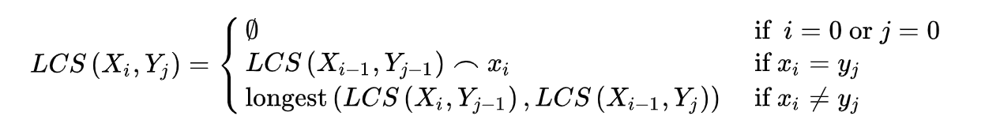

# LCS (longest-common-subsequence) problem

[longest-common-subsequence](https://en.wikipedia.org/wiki/Longest_common_subsequence_problem) differs from problem of finding the [longest common substring](https://en.wikipedia.org/wiki/Longest_common_substring_problem); and it has wide applications such as [diff utility](https://en.wikipedia.org/wiki/Diff_utility) and [bioinformatics](https://en.wikipedia.org/wiki/Bioinformatics).

The problem is formally defined as follows: define two strings for example _abcgf_ and _achfe_, find the same longest subsequence from both of them. A subsequence is composed of characters in same relative order within the string but not necessarily being contiguous. Strings like _ac_, _bc_, _bf_, _abf_ are all subsequences of string _abcgf_.

From all the subsequences of strings _abcgf_ and _achfe_, the common ones are _a_, _ac_, _cf_, _c_, _f_, _acf_, the longest common subsequence is _acf_.

## Analysis of this problem

Define two sequences X[0..m-1] and Y[0..n-1]. And L(X[0..m-1], Y[0..n-1]) be the LCS of the two sequences X and Y. LCS problem can be solved in dynamic programming for its satisfaction of two important factors:

- Optimal Substructure

  If a problem has an optimal solution and its sub-problems also have optimal solutions, then we say this problem has optimal substructure.

  In the above example, sequence X is _abcgf_ and sequence Y is _achfe_; Then, if the last characters of X and Y match we only need to find out if the preceding characters match: L(X[0..m-1], Y[0..n-1]) = 1 + L(X[0..m-2], Y[0..n-2]).

  If the last characters of X and Y do not match, we need to find out the maximal LCS between L(X[0..m-2], Y[0..n-1]) and L(X[0..m-1], Y[0..n-2]).

- Overlapping Subproblems

  In the recursion of finding common sequences, there are overlapping function calls; they are called overlapping subproblems:

  In the above example, finding the LCS of X and Y is broken down into finding L(_abcgf_, _achf_) and L(_abcg_, _achfe_), the next level recursions of both have overlapping subproblems: L(_abcg_, _achf_). By memoization, the computing cost can be saved significantly (from exponential time to polynomial time).

Then, the following formula is given for this problem to be solved in dynamic programming:

<figure style="text-align: center">
  
  <figcaption>Figure 1. LCS Formula</figcaption>
</figure>

## Pseudocode Solution

X of size m, Y of size n

```
LCS(X, Y)
  initialize a 2-D array L of size m+1 by n+1

  for i in m
    for j in n
      if i == 0 and j == 0
        L[i][j] = 0
      else if X[i - 1] == Y[j - 1]
        L[i][j] = 1 + L[i - 1][j - 1]
      else
        L[i][j] = max(L[i][j - 1], L[i - 1][j])

  return L[m][n]
```

The time and the space complexity are both &Omicron;(n &times; m).