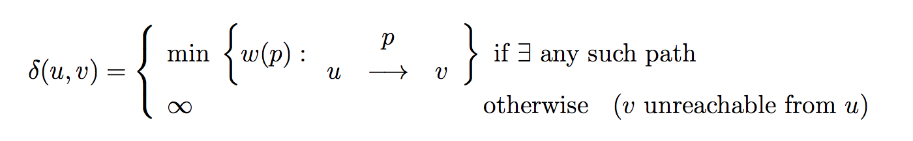

# Shortest Path

In a [Geo-spatial Network](https://en.wikipedia.org/wiki/Spatial_network) application, it is a common feature to compute shortest paths for various purposes, e.g. planning a route from current location to a destination on the geographic map; scheduling nearest [Uber](https://en.wikipedia.org/wiki/Uber) cars to users requesting ride service.

Specifically, there are two types of tasks to compute shortest paths: [single-source](#single-source) and [multi-source](#multi-source), both of which are computed based on **weighted graph** structures. One of the most important algorithms in the 20th is [Dijkstra's Algorithm](#dijkstras-algorithm).

## Generality

a path from &vscr;0 -> &vscr;k is defined by _p_ (&vscr;0 -> &vscr;0 is 0), and the shortest path from source &uscr; to &vscr; is:

<figure style="text-align:center">
  
  <figcaption>Figure 1. A Delta Function Denotes the Shortest Path Total Value</figcaption>
</figure>

## Single-Source

Given weighted graph _G_ = (_V_, _E_), weight w(u, v) of two vertices (u, v) and a source _S_, compute &delta;(_S_, _v_i) wherein _v_i is a vertex from vertices set _V_.

<figure style="text-align:center">
  
  <figcaption>Figure 2. Auxiliary Static Data Structure to Store Shortest Paths</figcaption>
</figure>

Mathematically, use the above structure to initialize to infinity and converge to the shortest paths values from a given source _S_ would yield the final solution at hand.

In addition, define another array &pi;i (i=1,2,...,n) to track the **predecessor** of all vertices, where &pi;[s] = s in order to output the shortest paths.

_Note: the convergence step is formally termed as **Relaxation**, which would be covered in Dijkstra's Algorithm discussion_.

The classical [Dijkstra's Algorithm](#dijkstras-algorithm) and [Bellman-Ford algorithm](#bellman-ford-algorithm) are further discussed based on the above assumptions.

### Dijkstra's Algorithm

Invented by Turing Award winner [Edsger W. Dijkstra](https://en.wikipedia.org/wiki/Edsger_W._Dijkstra), this algorithm adopts a [greedy](../greedy-algorithms/overview.md) approach to search for the shortest path among all the paths leading from a single source to the destination.

#### Fundamental Ideas

It is applicable for both directed and undirected graphs, in which the edges must have non-negative weights. In the original version of Dijkstra's algorithm, it only tries to find the minimal path between two nodes, but more commonly the modern variant can find the shortest paths from a single source
to all other nodes, producing a shortest path tree.

Specifically, for each edge (_u_, _v_) in a **non-negative** weighted graph _G_, maintain a set _S_ of vertices whose final shortest paths have been computed. Repeatedly select &uscr; out of _V_ - _S_ with minimum shortest path estimate, add &uscr; to _S_
and relax all edges adjacent and reachable from &uscr;.

<pre>
<code>
DIJKSTRA(graph, source)
  Initialize d array to either Infinity or 0 (s = source)
  Initialize &pi; array of vertices with their self
  set S := empty
  Q := a priority queue of reachable vertices from source
  while Q != empty
    u = EXTRACT_MIN(Q)    // deletes a vertex with minimal distance to the source
    S.add(u)
    for vertex v adjacent to u
      RELAX(u, v, d, &pi;)

  output array d and &pi;

RELAX(u, v, d, &pi;)
  if d[v] > d[u] + w(u, v)
    d[v] = d[u] + w(u, v)
    &pi;[v] = u;
</code>
</pre>

<figure style="text-align:center">
  
  <figcaption>Figure 3. An Example of Dijkstra's Algorithm</figcaption>
</figure>

### Bellman-Ford Algorithm

Though slower than peer shortest path algorithm like Dijkstra's, Bellman-Ford algorithm can compute the shortest paths from a single source that might bear negative edges in between.

Specifically, given a graph _G_ = (_V_, _E_), this algorithm answers true if a shortest path exists from a single source to a destination without cycles, otherwise answers false;

<pre>
<code>
BELLMAN_FORD(graph, source)
  Initialize d array to either Infinity or 0 (s = source)
  Initialize &pi; array of vertices with their self
  for i := 1 to |V| - 1
    for each edge (u, v) &isin; E
      RELAX(u, v, d, &pi;)   // same sub-routine as Dijkstra
  for edge (u, v) &isin; E
    if d[v] > d[u] + w(u, v)
      report a negative cycle exists, return false
  return true
</code>
</pre>

_Note: why do we care about negative edges? reasons include computational tasks in a water pipeline or electric wires, or financial models with various cost and revenue gains in many vertices_.

## Additional References

1. Shortest Paths II, MIT OpenCourseware, https://ocw.mit.edu/courses/electrical-engineering-and-computer-science/6-006-introduction-to-algorithms-fall-2011/lecture-videos/MIT6_006F11_lec16.pdf

