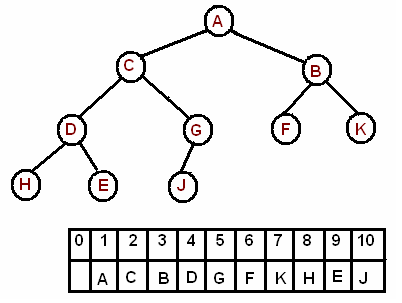

# Heap

[Heap](#heap) is a widely adopted data structure in various computing applications such as priority queues, heap sort<sup>[[1]](https://en.wikipedia.org/wiki/Heap_(data_structure))</sup> and so on.

Inherited from general [tree](overview.md) structure, a heap is either a [max-heap or a min-heap](#max-heap-and-min-heap). Normally, the heap is referred as binary heap, theoretical tree-like, which could be stored in either a static or dynamic structure such as a static array, tree nodes.

It is mostly favored to use a static array structure given that INSERTION operations of new entries always happen in a row from left-side of the tree to the right-side of the tree, which means the heap structure is nearly a [complete binary tree](overview.md) fully filled except the leaf level. Figuratively,

<figure style="text-align:center">
  
  <figcaption>Figure 1. Binary Heap in a Static Array Implementation</figcaption>
</figure>

New elements will be promptly appended to the end of the array and entry removal only happens at the _root_. And these operations will incur the [heap maintenance steps](#heap-property-maintenance) to ensure its status as a [max-heap or min-heap](#max-heap-and-min-heap)

_Note: There are certain operations to take such as PARENT(i) = i/2, which is the index of node i's parent; LEFT(i) = 2i, which is the index of node i's left child; RIGHT(i) = 2i + 1, which is the index of node i's right child_.

## Max Heap and Min Heap

In a max heap, the key of a node is larger than or equal to the keys of its children. The largest element is stored in root. Specifically, given an array _A_ for entry storage:

_A[PARENT(i)]_ &ges; _A[i]_

Similarly, a min heap will have keys of nodes are smaller than their children. The smallest entry is stored in root. Then,

_A[PARENT(i)]_ &les; _A[i]_

In a [Heap Sort](../sorting/heap-sort.md) algorithm, the max heap is chosen while the min heap is generally common in building a [priority queue](http://pages.cs.wisc.edu/~vernon/cs367/notes/11.PRIORITY-Q.html).

_Note: only max heap data structure is used in further discussions_.

## Heap Property Maintenance

A MAX-HEAPIFY is a critical process for heap property maintenance. Given an array A and an index i, assuming LEFT(i) and RIGHT(i) are both max heap. Then, MAX-HEAPIFY is called upon if A[i] smaller than its children in order to adjust the position of A[i] in the total heap to maintain the overall max heap property.

It is worth noted that MAX-HEAPIFY operation should only be performed where a single heap property violation happens. In a top-down fashion,

<pre>
<code>
MAX_HEAPIFY(A, i)
  l = left(i)
  r = right(i)
  if l &les; heap-size(A) and A[l] > A[i]
    largest = l
  else
    largest = i
  if r &les; heap-size(A) and A[r] > A[largest]
    largest = r
  if largest &ne; i
    swap A[i] and A[largest]
    MAX_HEAPIFY(A, largest)
</code>
</pre>

_Note: recursive calls happen because after swapping the current index i entry with left or right child, the corresponding right or left sub-tree could have a new heap property violation_.

The operations before each call of MAX_HEAPIFY take constant time, and the total number of calls on MAX_HEAPIFY is bounded by &Omicron;(_h_), wherein _h_ is the height of the heap. Therefore, the time complexity of MAX_HEAPIFY operation is &Omicron;(log(n)) for a n-entry heap.

## Build a Heap

Given an unordered inputs _A_ stored in a static array structure, build a max heap from it involves iterative calls to MAX_HEAPIFY operation. Specifically,

```
BUILD_MAX_HEAP(A)
  for i = length(A)/2 to 1
    MAX_HEAPIFY(A, i)
```

wherein all leaves of the heap are between the index length(A)/2 + 1 to length(A). The overall process is a bottom-up fashion and generate the max heap regardless of the number of heap property violations.

### Algorithm Analysis

At the bottom level of the heap, there are 2<sup>h</sup> nodes with each cost none for the heapify operation; at the level above the bottom, there are 2<sup>h-1</sup> nodes with each cost most 1 swapping for the heapify operation, and so on. Figuratively,

<figure style="text-align:center">
  
  <figcaption>Figure 2. Build Max Heap Total Work</figcaption>
</figure>

Then, at the level j, there are 2<sup>h-j</sup> nodes with each cost most j swappings for the heapify operation. Counting them up,

<figure style="text-align:center">
  
</figure>

By [infinite geometric series](https://en.wikipedia.org/wiki/Geometric_series#Proof_of_convergence), the sum of j/2<sup>j</sup> converges to 2; thus,

&Tau;(n) &les; 2<sup>h+1</sup> = n + 1 = &Omicron;(n)

Obviously, the operation must access each of the inputs during heap building and a more tighter bound will be &Theta;(n).

## Additional References

1. Data Structures: Heaps. https://www.youtube.com/watch?v=t0Cq6tVNRBA

2. Lecture Notes: Heapsort analysis. http://www.cs.umd.edu/~meesh/351/mount/lectures/lect14-heapsort-analysis-part.pdf