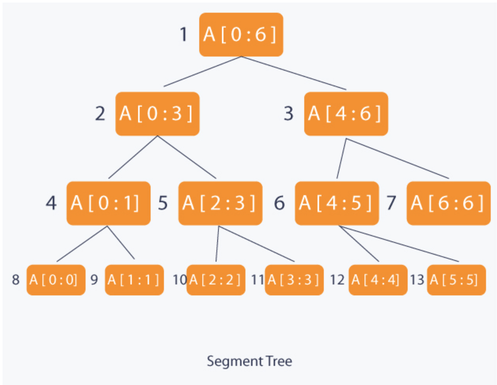

# Segment Tree

Segment tree is a contextual binary tree designed for storing intervals or segments of a series of data items to speed up specific queries such as [Range Minimum Query](https://en.wikipedia.org/wiki/Range_minimum_query). Being contextual, each node of the segment tree represents an interval of data indices. Consider the following example:

An array of integers _INPUT_ of size N, build a segment tree _T_ which has:

1. The _root_ of _T_ represents the data to be queried within interval _INPUT[0...N-1]_
2. Leaves represent a single element INPUT[i] where 0 <= i < N.
3. The internal nodes in level _h_  of _T_ represents 2h number of nodes, each have data to be queried from interval from _INPUT_[i...j], where 0 <= i < j < N

There are N leaves in T and N - 1 internal nodes. Thus, the total number of nodes is 2 &sdot; N - 1. When the segment tree is built, its structure cannot be changed.

<figure style="text:center">
  
  <figcaption>Figure 1. A Segment Tree Built on an Array of size 7</figcaption>
</figure>

There are two operations that can be performed on a segment tree:

1. update: given an index and a value within the array, update the corresponding element. The time complexity is &Omicron;(log N) time.
2. query: given index _l_ and _r_, return the contextual value within the interval from _l_ to _r_. (e.g. the minimal value within the range). In average, each query takes &Omicron;(log N) time.