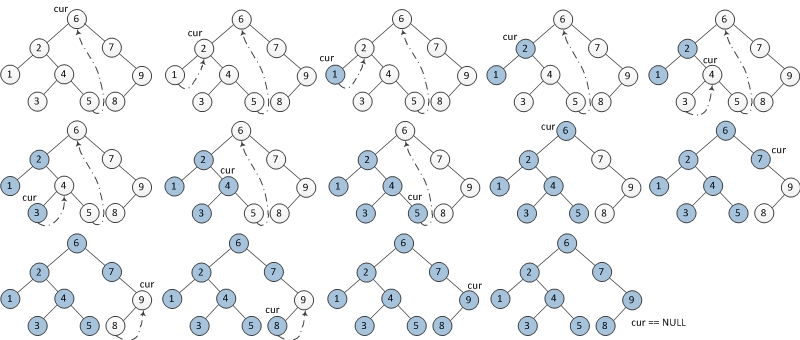

# Threaded Binary Tree

Unlike [DFS](https://en.wikipedia.org/wiki/Depth-first_search) which adopts recursive algorithms to traverse a tree before backtracking (the stack space of recursive calls would be &Omicron;(n)) and unlike [BFS](https://en.wikipedia.org/wiki/Breadth-first_search) which needs a queue to help traverse the tree level by level, [Threaded Binary Tree](https://en.wikipedia.org/wiki/Threaded_binary_tree) can achieve traversing a binary tree with only &Omicron;(1) extra space allowed. The traverse method adopting Threaded Binary Tree is also called Morris Traversal.

That said, we do not need to allocate additional memory for each node in the tree. Only using the left and right _null_ pointers of leaves to point to _some_ predecessors or successors would be necessary, which also maintains the original tree structure intact. In a standard Morris traversal algorithm, there is only an _in-order_ version and this chapter only introduces that version. Further modifications could be explored by the users.

## In-order Morris Traversal

### Basic Ideas

Given a binary tree and its root node, the steps of the traversal algorithm includes:

1. If _current_ node's left child is null, output the _current_ node's value and set its right child as the new _current_ node.

2. Else if _current_ node's left child is not null, then try to find the _predecessor_ for _current_ node's left subtree in the _in-order_ traversal.

    - 2-1 If the right child of this _predecessor_ is null, set it to _current_ node and update new _current_ node to be the left child of _current_ node.

    - 2-2 Else if the right child of this _predecessor_ is the _current_ node, reset the right child to null (same as recover the original tree structure) and output the _current_ node.

repeat step 1 and 2 until _current_ node is null.

<figure style="text-align:center">
  
  <figcaption>Figure 1. In-order Morris Traversal Demonstration</figcaption>
</figure>

### Complexity

There are only two additional pointers used, thus requires only &Omicron;(1) for space. Time complexity is &Omicron;(n) since the number of searches for all _predecessors_ of all nodes is bounded by c &times; n (a binary tree with n nodes has no more then n - 1 nodes, every edge is traversed at most twice).

In the following figure where red dotted lines denote the process of finding such nodes while black dotted lines denote the process of finding predecessors.

<figure style="text-align:center">
  
  <figcaption>Figure 2. Total number of searches</figcaption>
</figure>
