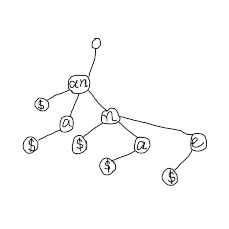
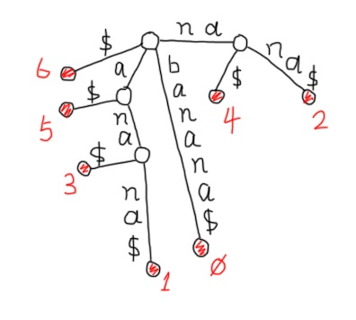

# String Matching

Given a text [string](https://en.wikipedia.org/wiki/String_(computer_science)) _T_ and a pattern _P_ (a substring, a character or a [Regular Expression](https://en.wikipedia.org/wiki/Regular_expression)), which are both in the defined character set &sum;, find some/all occurrences of _P_ within _T_ is termed the task of [string matching](#string-matching).

There are multiple string-matching applications in computing such as the popular [_grep_](https://en.wikipedia.org/wiki/Grep) UNIX tool in finding patterns within data sets.

Generally, there are two kinds of techniques in string matching tasks:

1. one-shot algorithmic approach: &Omicron;(T) time in average, examples include [KMP algorithm](#knuth-morris-pratt-algorithm), [Rabin-Karp algorithm](#rabin-karp-algorithm).

2. static data structures approach: preprocess string _T_ and optimally obtain a &Omicron;(P) time and &Omicron;(T) space.

## One-shot Approach

Obviously, algorithmic solutions that needs nearly no preprocessing are categorized as one-shot. There are various methods trying to improve upon the naive string match such as [Rabin-Karp algorithm](#rabin-karp-algorithm) and [KMP algorithm](#knuth-morris-pratt-algorithm).

### Naive String Match

A naive algorithm would be built under a principle of ["brute-force" search](https://en.wikipedia.org/wiki/Brute-force_search) that beginning from each character occurrence of target strings (_t_), find whether the source string (_s_) matches a successive portion of target strings (_t_).

```
NAIVE_STRING_MATCH(s, t)
  for i in range length(t) - length(s)
    if s = t.substring(i, i+length(s))
      return true
  return false
```

It takes &Omicron;(|s|) for each substring comparison and the total number of comparison is &Omicron;(|t| - |s|), then

&Tau;(n) = &Omicron;(|s| &sdot; |t|) &ap; [quadratic time](../asymptotic-analysis.md)

### Rabin-Karp Algorithm

Rabin-Karp or Karp-Rabin algorithm, is a string searching primitive that uses [hashing](hash-table.md) technique. Specifically, it requires to compare a hash value for the _pattern_ with distinct hashes of the sub-text in the target string.

If hash computations are performed each time on sub-text, the overall complexity is even higher than the [naive string match](#naive-string-match). Therefore, a [rolling hash](#rolling-hash) technique is introduced. The design of such [hash function](hash-table.md) varies in different scenarios to provide a reasonable computation complexity and some magnitude of randomness. In the following discussions, it is assumed the hash function &hscr; satisfies the [simple uniform hashing](hash-table.md).

#### Rolling Hash

A rolling hash is a hash function that process inputs within a sliding window, it is powerful to rapidly calculate the hash value for the new entry without having to rehash it.

Given a string _ABCDBBCA_ and a pattern _BCDB_; compute the hash value of pattern &hscr;(BCDB) and the first sub-text in the string &hscr;(ABCD), the result does not match, thus slide the window right by 1 slot; generate the new hash value &hscr;(BCDB) by rolling hash (append a character _B_ to the end of old hash value and skip the tail character value _A_ from the old hash value); the new results have a match, procedure ends.

<figure style="text-align:center">
  
  <figcaption>Figure 1. Rolling Hash Example</figcaption>
</figure>

```
RABIN_KARP(s, t)
  hs := hash(s)
  ht := hash(t[1..length(s)])
  for i in range length(t) - length(s)
    if hs = ht
      return true
    else
      ht := ht.append(t[length(s) + i])
      ht := ht.skip(i)
  return false
```

Since the hash function processes the The expected running time for Rabin-Karp algorithm in string matching is &Omicron;(|s| + (|t| - |s|) &sdot; cost(&hscr;)); In the naive version of hashing, the cost of &hscr; will be persistent as |s|, the overall complexity would be &Omicron;(|t| &sdot; |s|) &ap; [quadratic time](../asymptotic-analysis.md). By adopting [rolling hash](#rolling-hash), the cost of hash function could be reduced down to &Omicron;(1), thus time complexity for [Rabin-Karp algorithm](#rabin-karp-algorithm) is &Omicron;(|t|) &ap; [linear time](../asymptotic-analysis.md)

### Knuth-Morris-Pratt Algorithm

(this section is not yet covered)

## Static Data Structures

In the context of massive dataset of WEB, preprocessing before performing searching or statistical operations is necessary to reduce the time complexity, even demanding in the real-time systems.

### Tries

A trie, also called radix tree or prefix tree, as the name suggests, is a tree-alike data structure for searching primitives (trie comes from the word _retrieval_). It sacrifices memory space in exchange of better searching performance and it satisfies the following properties:

1. the root of trie contains _NULL_ entries.
2. strings with same prefixes share the common ancestors in the trie.
3. the root-to-leaf path represents the entire string and terminated with a special character $ that is not in the set &sum;.

Specifically, given an input: {an, ana, ann, anna, anne}, constructing a trie:

<figure style="text-align:center">
  
  <figcaption>Figure 1. Trie Representation in a Tree</figcaption>
</figure>

_Note: there are some denotations mark the **edges** as characters instead of nodes, which conveys the same meaning_.

Since the generation of a trie is one-pass and remain static afterwards, it is wise to contract some of the adjacent edges (nodes) which have a single descendent to one edge (node) for searching simplicity. Then, a **compressed trie** would look like:

<figure style="text-align:center">
  
  <figcaption>Figure 2. Compressed Trie</figcaption>
</figure>

_Note: it is valid to contract the termination character ($) to the final character node, the version provided here only assists comprehension_.

Roughly, query strings in the [Trie](#tries) cost &Omicron;(P) in time (**LOOKUP time is independent of the number of strings in the trie!**) and &Omicron;(T) in space; Nonetheless, there are slight variations among different data representations, if you are interested, check [here](https://courses.csail.mit.edu/6.851/spring12/lectures/L16.pdf).

_Note: if the character set is ASCII based, it is recommended to use static data structures such as array (e.g. array[1..128]) to store children of a node instead of a dynamic structure like list (which costs linear time than constant to search for the prefixes and the cost of querying strings exceeds &Omicron;(P))_.

* Applications

In the world of Internet, Trie has numerous useful applications. For instance, the autocomplete feature of search box in various websites such as Google, can be embedded with a Trie data structure whenever you type in a letter, the Trie gets pruned and greatly increase the speed of next search.

It is common that misspelled words share similar prefixes as the correct words, and Trie can be helpful in performing string matching algorithm in this context of spell check.

### Suffix Trie

Normally, suffix trie is also called suffix tree and as the name suggests, it stores the suffixes of a string in ways [compressed trie](#tries) store prefixes. The difference between a compressed trie and a suffix trie is that suffix trie uses all suffixes of a single string which is appended with a $ and a trie terminates a bunch of strings with $.

For instance, given a string "banana" and build a suffix trie for that, first a $ has to be appended to the end of the string, namely "banana$"; then list all its suffixes "banana$", "anana$", "nana$", "ana$", "na$", "a$" and "$"; finally, prefix them in a trie structure to obtain the suffix tree:

<figure style="text-align:center">
  
  <figcaption>Figure 3. Suffix Trie Representation</figcaption>
</figure>

* Applications

There are many practical uses of Suffix Trees such as Longest Common Substring problem, Genomic projects, etc. It is worth noted Suffix Tree is not practical in single searches since preprocess the given text requires a large amount of time.

## Additional References

1. What is a rolling hash and when is it useful? https://www.quora.com/What-is-a-rolling-hash-and-when-is-it-useful

2. Suffix Trees, HackerEarth. https://www.hackerearth.com/practice/data-structures/advanced-data-structures/suffix-trees/tutorial/

3. Applications of Suffix Trees http://www.cs.uku.fi/~kilpelai/BSA05/lectures/slides08.pdf