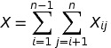

# Quick Sort

Developed by [Tony Hoare](https://en.wikipedia.org/wiki/Tony_Hoare) early in 1950s, [Quick Sort](#quick-sort) follows the [DnC](../divide-and-conquer/overview.md) pattern but without the COMBINE phase in common DnC paradigm.

_An animated example:_ **[Quick Sort Animation](https://en.wikipedia.org/wiki/Quicksort#/media/File:Sorting_quicksort_anim.gif)**

## Fundamental Ideas

Given an input array of length n, choose a **pivot** in the array and _partition_ around it in order that the left half of array has elements less than the value of the **pivot** while the right half of array has elements larger than the value of the **pivot**. It applies to all recursive calls with all sub-arrays until the base case in order that all elements are sorted in place.

Unlike the [Merge Sort](merge-sort.md), [Quick Sort][quick-sort] is implemented in a style of [_sort-in-place_](overview.md) with little extra memory usage. [Quick Sort][quick-sort] is prevalent in many practical applications and its [average-case](../asymptotic-analysis.md) running time &Omicron;(n &sdot; log n) equates many of existing performant comparison-based implementations like [MergeSort](merge-sort.md).

Different partition methods incur distinct expected running time in total. It is widely adopted to use [randomized partition](#randomization-partition.md) but the naive partition methods are still worth to study.

## Pseudocode

```
QUICK_SORT(A, low, high)
  if low < high
    p := PARTITION(A, low, high)
    QUICK_SORT(A, low, p - 1)
    QUICK_SORT(A, p + 1, high)
```

_Note: partition methods might vary in accordance with different inputs. Of many schemes, the [media-of-three](#median-of-three-partition) is most recommended choice in practical use._

## Partition Schemes

### Lomuto Partition

Lomuto Partition scheme chooses the last element from the array as the pivot as the recursion goes on. It is considered an introductory scheme for [QuickSort][quick-sort] yet less efficient than [Hoare Partition](#hoare-partition) scheme.

<pre>
<code>
LOMUTO_PARTITION(A, low, high)
  pivot := A[high]
  i := low - 1
  for j := low to high
    if A[j] &les; pivot
      i := i + 1
      if i &ne; j
        swap A[i] with A[j]
  return i
</code>
</pre>

### Hoare Partition

In the paper of [Quicksort](https://academic.oup.com/comjnl/article-lookup/doi/10.1093/comjnl/5.1.10) written by Hoare, an original partition method is adopted.

The fundamental idea is to always partition around the first element in the array. Two indices are used in both ends of the sub-arrays and progress towards each other to the middle until an inversion of a pair is found.

<pre>
<code>
HOARE_PARTITION(A, low, high)
  pivot := A[low]
  i := low - 1
  j := high + 1
  loop
    do
      i := i + 1
    while A[i] < pivot

    do
      j := j - 1
    while A[j] > pivot

    if i &ges; j
      return j

    swap A[i] with A[j]
</code>
</pre>

A modest comparison of [Hoare's and Lomuto's partition scheme](https://cs.stackexchange.com/questions/11458/quicksort-partitioning-hoare-vs-lomuto) shows that Hoare partition runs three times smaller of swaps on average than Lomuto's.

### Median-of-three (Mo3) Partition

Promoted by [Robert Sedgewick](https://en.wikipedia.org/wiki/Robert_Sedgewick_(computer_scientist)), the "median-of-three" scheme describes itself as choosing the median value among the first, last and middle elements of the array as the pivot.

It overcomes the problem of sorting almost sorted or reversely sorted arrays with a [worst-case](../asymptotic-analysis.md) &Omicron;(n<sup>2</sup>) by offering a relative "median" choice of an optimal _pivot_.

### Randomized Partition

[Quick Sort][quick-sort] with a randomized partition is termed as the randomized QuickSort. It achieves an expected running time with an estimate of &Omicron;(n &sdot; log n).

In the section of [**randomized algorithms**](../randomization/randomized-algorithms.md), an algorithm of randomized selection is introduced and its principle is chosen as the foundation to build the pivot selection subroutine of randomized QuickSort.

## Issues

Quick sort is sometimes effortless in sorting task; given an almost sorted array, it is a waste of code execution for too many comparisons and not to mention that _pivot_ choosing takes time. And [Insertion Sort](insertion-sort.md) is better in dealing with nearly sorted list.

Still, the quick sort scheme might inadvertently choose the least or most value of the sub-array in every recursion, resulting in a [worst-case](../asymptotic-analysis.md) &Omicron;(n<sup>2</sup>) comparisons. In other cases quick sort might be expecting to have efficiency of &Omicron;(n &sdot; log n) given the medians of every sub-arrays are chosen in each iteration.

If there are duplicate elements in the array, or say elements with same value, standard quick sort routines won't work as brilliant as we expect. In a typical [Dutch National Flag problem](https://en.wikipedia.org/wiki/Dutch_national_flag_problem), a three-way partitioning routine is adopted to split the values into three groups: color of balls is red, color of balls is white and color of balls is black; Then, an improved [QuickSort][quick-sort] should look like:

<pre>
<code>
QUICK_SORT(A, low, high)
  if low < high
    p := choose_pivot(A, low, high)
    left, right := partition(A, p, low, high)  // two return values
    QUICK_SORT(A, low, left - 1)
    QUICK_SORT(A, right + 1, high)
</code>
</pre>

## Algorithm Analysis

If every time the least or most value of sub-arrays been chosen as _pivot_s, the resulting complexity would be &Omicron;(n<sup>2</sup>).

If every time the median value of the sub-array been chosen as _pivot_ (**best pivot**), the resulting complexity would be &Omicron;(n &sdot; log n). It still holds even if the _pivot_ got chosen randomly in each run, what to be noted is there is no assumptions on data sets.

_**Proof**_:

_Note: the [master method](../divide-and-conquer/master-method.md) is not applicable here given that the subproblems are unbalanced and unpredictable_.

1. Define entry variable &zscr;<sub>i</sub> as the i<sup>th</sup> smallest element in the inputs.
2. Create an [indicator random variable]() _X_<sub>ij</sub> = I{ &zscr;<sub>i</sub> compares &zscr;<sub>j</sub> }.
3. Then, the total number of entry comparisons:

<figure style="text-align:center">
  
</figure>

4. Apply [linearity of expectation](),

<figure style="text-align:center">
  
</figure>

<figure style="text-align:center">
  
</figure>

wherein Pr(&zscr;<sub>i</sub> compares &zscr;<sub>j</sub>) = Pr(&zscr;<sub>i</sub> is chosen as the pivot) + Pr(&zscr;<sub>j</sub> is chosen as the pivot) = 1 / (j-i+1) + 1 / (j-i+1) = 2 / (j-i+1)

5. Summing up terms separately, the [asymptotic approximation](../asymptotic-analysis.md) is obtained,

<figure style="text-align:center">
  
</figure>

<figure style="text-align:center">
  
</figure>

complexity holds, proof ends.

[quick-sort]: (#quick-sort)
